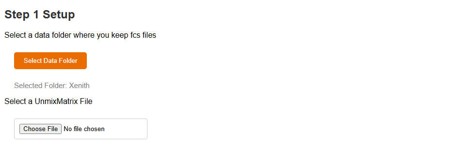
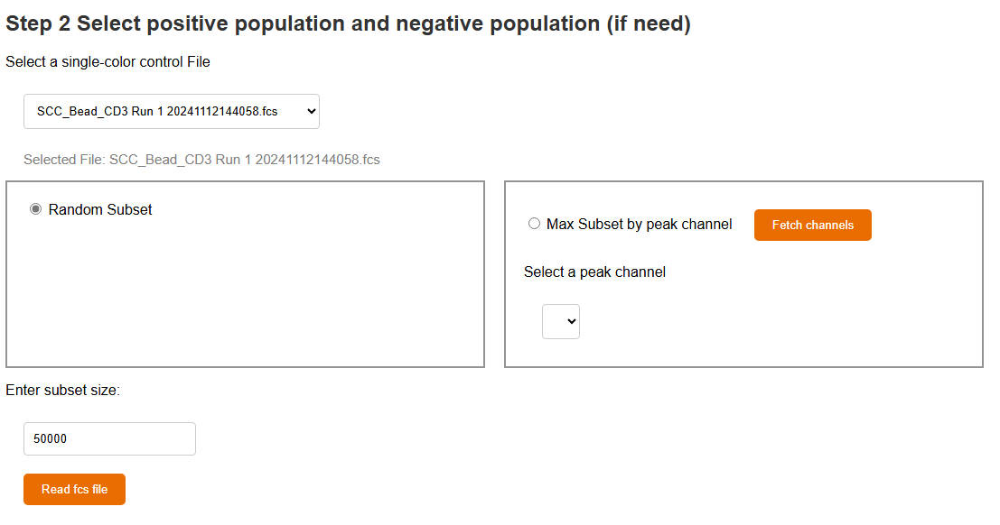
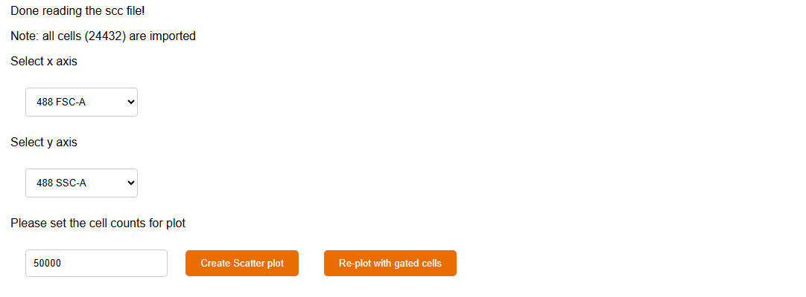
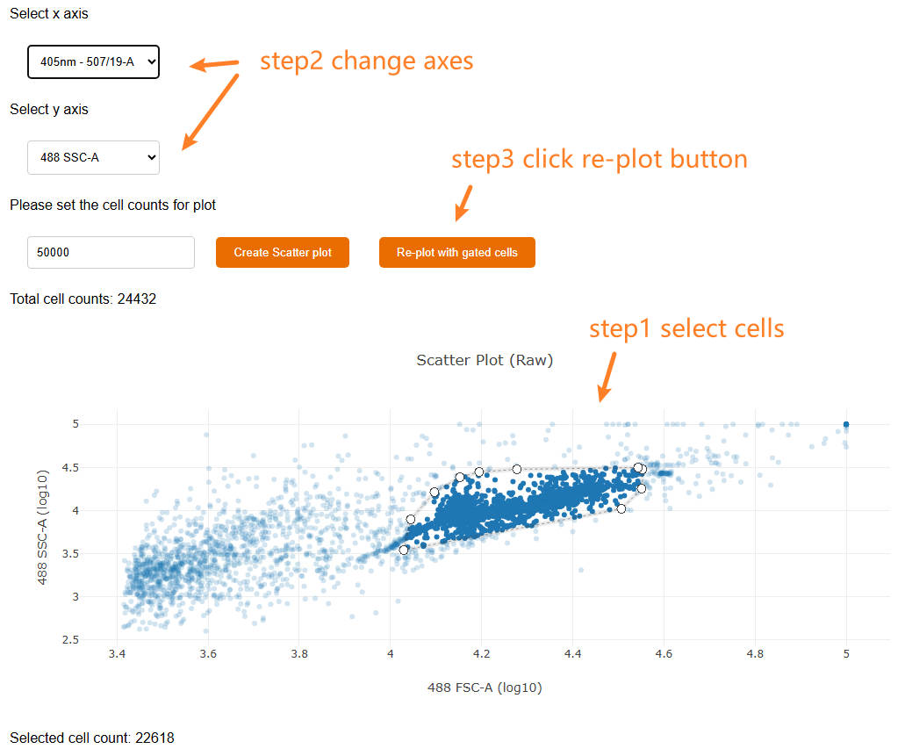
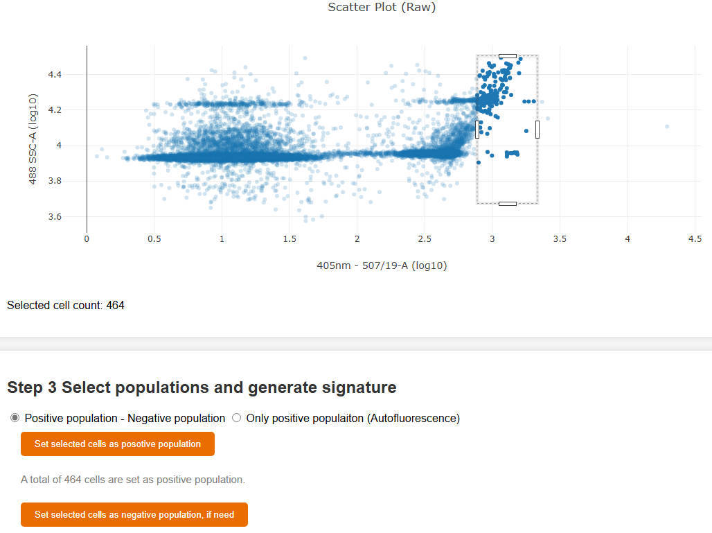
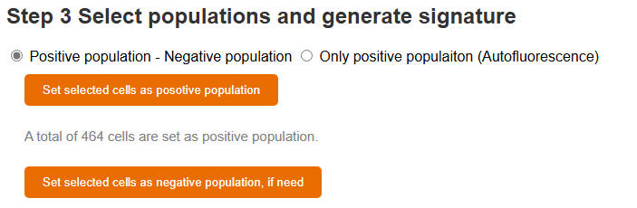
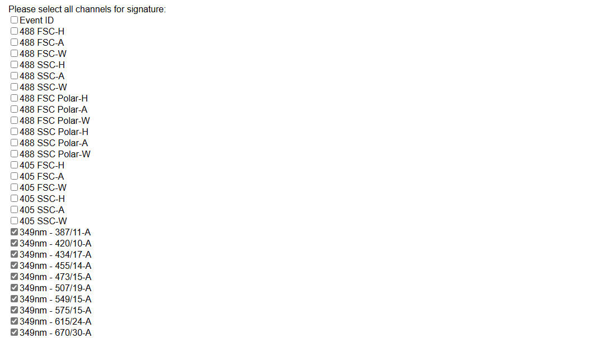
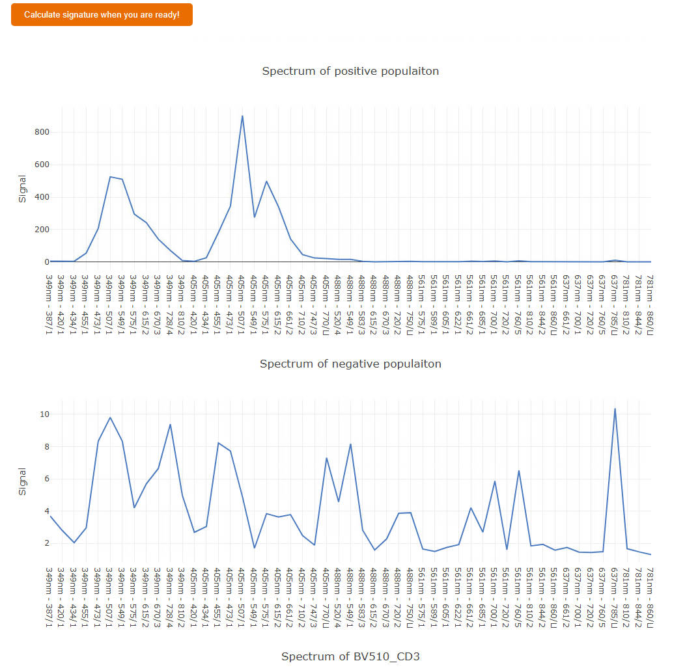
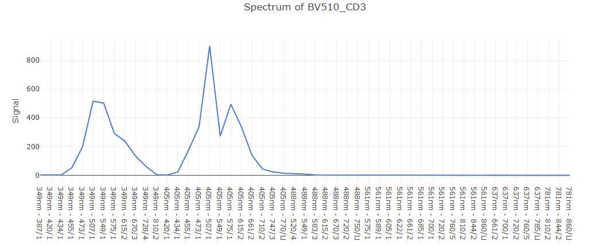

# Unmixing Matrix Generator (UMG)

Xiangming Cai   
2025 April 3

Welcome to the Unmixing Matrix Generator, your go-to tool for generating the unmixing matrix for flow cytometry analysis. This guide will help you understand how to use the tool.

Visit the project in [Github](https://github.com/xiangmingcai/UnmixingMtxGenerator.github.io).


## Introduction and Application scenario

For spectral flow cytomery experiments, users could develop a panel with up to 50 fluors. These spectral flow instruments could have more than 60 channels (detectors). These detectors will detect signal intensity at various wavelength.

It is a challenge to unmix the mixed signals in multi-color samples and have the separate signal for each fluor. To do the unmixing, users needs single-color controls (cells/beads) to extract the signature for each fluor. The signature means the signal intensity at each channel (detector). For a spectral flow cytometer with 60 detector, a signature will contain 60 numbers.

If you have a 30-color panel, that means you need 30 signatures for  each fluor to do unmixing. Besides that, you may need one or few signatures for autofluorescences (AF). 

**To extract signatures for each fluor**, you need a single color control sample. Within the sample, you will find cells/beads positively stained with the fluor. You will also find negative cells/beads not stained with the fluor. These cells are called as "positive population" and "negative population". Since the cells/beads also have autofluorescence, you need to subtract the signals of "negative populaiton" from the signals of "positive population". **While for autofluorescence signature**, you only need to select the population with the autofluorescence that you care.

**The UMG is designed to guide you select populations, extract signatures, and generate the unmixing matrix.** Afterward, you may use the unmixing matrix to do unmixing, which is supported by most flow analysis programs, including FCS Express, OMIQ and so on. We also have a webtool, [UIB](https://github.com/xiangmingcai/UnmixingInBatch.github.io), to help you do Unmixing In Batch. 

If you find unmixing issues, you may consider optimize the unmixing matrix with [UMO](https://github.com/xiangmingcai/UnmixingMtxOptimizer.github.io), another webtool that we developed for unmixing matrix optimization. 


## Requirements

**Operating System**: No requirment for Operating System. 

**Browser**: The UMG was tested with Microsoft Edge. So, probably Chrome also works. However, Firefox is not supported.

**Hardware**:
It depends on the fcs files that you are using. In general, a 16 GB RAM or higher is recommended.

Internet connection is needed.


## Installation 

No installation is needed. You could simply open the **[Unmixing Matrix Generator (UMG)](https://xiangmingcai.github.io/UnmixingMtxGenerator.github.io/)** website and use it.


## File preparation

### All you need is single-color control fcs files

The selection between single-color control beads or cells is part of you experiment design. The UMG accept both cells and beads and will not judge. In general, you may consider start with beads to aquire purer signatures.

You may consider using negative samples to extract AF signatuers.

Raw fcs files exported from Aurora, Xenith, Fortessa, and CytPix are tested and supported by UMO and UMG.

We are also testing other flow cytometers and will update when we have results.

Ideally, the UMG should be able to handle the fcs file that you aquired directly from your flow cytometer. The fcs file should contain the raw data for each channel (detecter). It does not matter if you have unmixed results (if you did unmixing in the instrument software) in the exported fcs files. You could select which channels to use in the UMG.

## Usage Steps

With the UMG, you could extract **one** signature at a round. 

In the first round, you will extract the first signature and have an simi-finished unmixng matrix file exported. 

Then, you fresh the website, import the simi-finished unmixng matrix, and do the second round. Now you get the second signature and an updated simi-finished unmixng matrix with the second signature. 

Afterward, you could repead the process until you have all signatures that you need.

If you want 30 signatures, you need to run the UMG 30 rounds. But do not worry, the UMG is really quick and easy to use. You probably could finish **everything** in 30 mins ~ 1 h.

### 1. set up

First, press the button to select a data folder, where your fcs files are stored. The UMO will search the folder to generate a file list below.

Second, select the unmixing matrix **csv** file, and click the "Read the UnmixMatrix CSV" button to check the imported matrix. 

<p align="center">
  
</p>

In the first round, you do not have an unmixing matrix file yet. So you could click "I do not have the UnmixMatirx CSV" button.

In the second or later rounds, you already have a semi-finished unmixing matrix, which you could select and import.

<p align="center">
  
</p>

Now you could see the input boxes, where you need to type in the Primary name and Secondary name of the signature. There are no specific limitations of naming. 

You could put any content in these two boxes, as long as they make sense to you.

You may use the combination of letters, numbers, symbols, and spaces. However, I personally do not like spaces and symbols, except underscore, to avoid potential error in other programs.


### 2. select populations

<p align="center">
  
</p>

Once you submit the signature names, you would see the fcs file setup part. Here you need to select the correct fcs file. You probably do not need all cells/beads in the file, so you may do sutset while reading the fcs file.

The UMG provide two methods for subset sampling. The first is "Random subset", which is simply random selection of cells/beads. The second one is "Max Subset by peak channel". To use this method, you need to select a peak channel for the fluor. The UMG will select the cells/beads with highest values in the peack channel. This method will be useful when you only have a small proportion of positive cells/beads.

You could select positive and negative populations from different fcs file. So, do not worry that you may have no negative cells/beads if you use the "Max Subset by peak channel" option.

<p align="center">
  
</p>

If you chooes the "Max Subset by peak channel" method, you could fetch all channels in the fcs file by clicking the "Fetch channels" button. **The UMG will find the peak channel for you.** If you do not like the found peak channel, you may select another one.

You could also set the subset size. If you want to keep all cells/beads, you may use "Random Subset" and set a really high subset size number.

<p align="center">
  
</p>

After reading the fcs file, you need to set up plot parameters for scatter plot, where you could select populations.
```
In UMG, you have "imported cells", "plot cells", "gated cells", and "selected cells". 

The "imported cells" are all imported cells from the fcs file, you set the size of it when reading the fcs file. 

The "plot cells" are a subset (random selection) of "imported cells". You set the "plot cells" in the input box next to the "Create Scatter plot" button. These "plot cells" are used to generate the first scatter plot.

If you do some gating, the cell counts on the plot will decrease. Those are the "gated cells", which is a subset of "plot cells".

When you are done with gating, you would select a populaiton of cells, and set them as "positive populaiton" or "negative populaliton". The cells in the "positive populaiton" or "negative populaliton" are "selected cells". It is a subset of "gated cells".

It sounds complex. However, it is in fact simple and intuitive. I'm sure you will get me once you tried the UMG.
```

You could find two plot buttons, "Create Scatter plot" and "Re-plot with gated cells". The "Create Scatter plot" button will generate a scatter plot with all "plot cells". While the "Re-plot with gated cells" button will generate a scatter plot with gated cells.

You probably want to do some gating first. If so, you could set the x and y axes and click the "Create Scatter plot" button. Also, The UMG will automaticly set the peak channel as the default x axis. 

```
**plotly tools**
The interactive scatter plot is made with [plotly.js](https://plotly.com/javascript/).  When your mouse hover over the plot, you will find some buttons on the right upper corner. You may use them to zoom in, zoom out, move, or download the plot as png. 

There is also a box selection and a lasso selection botton. You could use them to select cells
```

<p align="center">
  
</p>

Both axes are log10 scaled.

To do gating, you need to follow 3 steps:

1. Select cells;
2. Select new axes;
3. click "Re-plot with selected cells" button.

Sometimes you might accidently click re-plot button without select new axes. No worries, you could continue by selecting all cells and make new gating plot.

Also, it is always ok to click "Create Scatter plot" button to restart selection.

When you finish gating and find the ideal population, you could click the "Set selected cells as posotive population" or "Set selected cells as negative population, if need" button to secure the selection.

If the selection is secured, you will find a new reminder line shown below the button.

<p align="center">
  
</p>

After select the positive population, you may continue to select negative populaiton on the same scatter plot. You could also select another fcs file, read it, and draw new scatter plots. Your previously selected positive population will be loss as long as you did not fresh the whole webpage.


### 3. generate signature

<p align="center">
  
</p>

The UMG provides two types of signatures. 

The first one is for fluors, which will subtract the signal of negative population from the signal of positive populaiton.

*New signature = Positive population - Negative population*

The second one is for autofluorescence, which only needs positive populaiton.

*New signature = Positive population*

If you select the AF option, you will only be asked to select positive population

<p align="center">
  
</p>

In the first round of using UMG, you have no unmixing matrix provided. So you need to tell UMG which channels that you need. Of cause, the UMG will automaticly check some channels for you. Please double check if any channel is incorrect. 

From the second round of using UMG, you will have a semi-finished unmixng matrix uploaded. UMG will check the matrix itself and select the channels needed for you. If there is any channel missed, you will see the worring when you upload the fcs file.

You can not change the order of channels in the UMG. However, you could do this in Excel when you get your unmixing matrix file. It is also fine if you channge the order of channels in a semi-finished unmixing matrix csv file. The UMG will check the matrix and reorder the channels in fcs file when reading it.

<p align="center">
  
  
</p>

Yes! by clilcking the "Calculate signature when you are ready!" button, you could have the signature calculated! You would find the spectrum visulized as a linchart. If you want to adjust a little bit, you do not need to restart the whole page at all. You could simply reselect cells above and set populaitons again.


### 4. save results

<p align="center">
  
</p>
Now you could save the unmixing matrix with a new signature! 🥳

You need to select the normalization strategy for the new signature. If you are going to use the unmixng matrix in OMIQ, you may leave it as the "Normalize to 1" default option.  

Although we have "No normalization" option, it is not recommend.

If you want to normalize your matrix afterward, you may do so in Excel with a simple [formula](https://support.microsoft.com/en-us/office/overview-of-formulas-in-excel-ecfdc708-9162-49e8-b993-c311f47ca173) and [drag operation](https://support.microsoft.com/en-us/office/paste-options-8ea795b0-87cd-46af-9b59-ed4d8b1669ad).

You can also save the log for your experiment records. **Please note that UMG is a static website, meaning everything you do with UMO is 100% local.** No data is sent out, and we do not store any user information. Therefore, if you want to save your process or results, you will need to do so manually.

## Citation and Support

If you find this tool helpful, please consider citing our work in your research. For more information, visit the GitHub project page.

If you encounter any issues, feel free to report in the [github repository](https://github.com/xiangmingcai/UnmixingMtxGenerator.github.io/issues). 

Thank you for your support! 😊
