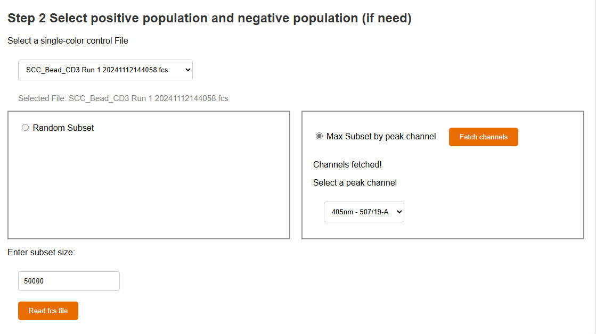
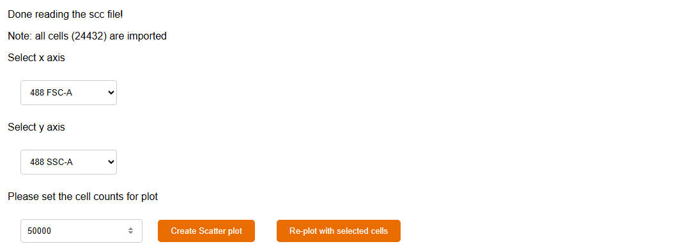

# Unmixing Matrix Generator (UMG)

Xiangming Cai   
2025 April 3

Welcome to the Unmixing Matrix Generator, your go-to tool for generating the unmixing matrix for flow cytometry analysis. This guide will help you understand how to use the tool.

Visit the project in [Github](https://github.com/xiangmingcai/UnmixingMtxGenerator.github.io).


## Introduction and Application scenario

For spectral flow cytomery experiments, users could develop a panel with up to 50 fluors. These spectral flow instruments could have more than 60 channels (detectors). These detectors will detect signal intensity at various wavelength.

It is a challenge to unmix the mixed signals in multi-color samples and have the separate signal for each fluor. To do the unmixing, users needs single-color controls (cells/beads) to extract the signature for each fluor. The signature means the signal intensity at each channel (detector). For a spectral flow cytometer with 60 detector, a signature will contain 60 numbers.

If you have a 30-color panel, that means you need 30 signatures for  each fluor to do unmixing. Besides that, you may need one or few signatures for autofluorescences (AF). 

**To extract signatures for each fluor**, you need a single color control sample. Within the sample, you will find cells/beads positively stained with the fluor. You will also find negative cells/beads not stained with the fluor. These cells are called as "positive population" and "negative population". Since the cells/beads also have autofluorescence, you need to subtract the signals of "negative populaiton" from the signals of "positive population". **While for autofluorescence signature**, you only need to select the population with the autofluorescence that you care.

**The UMG is designed to guide you select populations, extract signatures, and generate the unmixing matrix.** Afterward, you may use the unmixing matrix to do unmixing, which is supported by most flow analysis programs, including FCS Express, OMIQ and so on. We also have a webtool, [UIB](https://github.com/xiangmingcai/UnmixingInBatch.github.io), to help you do Unmixing In Batch. 

If you find unmixing issues, you may consider optimize the unmixing matrix with [UMO](https://github.com/xiangmingcai/UnmixingMtxOptimizer.github.io), another webtool that we developed for unmixing matrix optimization. 


## Requirements

**Operating System**: No requirment for Operating System. 

**Browser**: The UMG was tested with Microsoft Edge. So, probably Chrome also works. However, Firefox is not supported.

**Hardware**:
It depends on the fcs files that you are using. In general, a 8 GB RAM or higher is recommended.

Internet connection is needed.


## Installation 

No installation is needed. You could simply open the **[Unmixing Matrix Generator (UMG)](https://xiangmingcai.github.io/UnmixingMtxGenerator.github.io/)** website and use it.


## File preparation

### All you need is single-color control fcs files

The selection between single-color control beads or cells is part of you experiment design. The UMG accept both cells and beads and will not judge. In general, you may consider start with beads to aquire purer signatures.

You may consider using negative samples to extract AF signatuers.

Raw fcs files exported from Aurora, Xenith, Fortessa, and CytPix are tested and supported by UMO and UMG.

We are also testing other flow cytometers and will update when we have results.

Ideally, the UMG should be able to handle the fcs file that you aquired directly from your flow cytometer. The fcs file should contain the raw data for each channel (detecter). It does not matter if you have unmixed results (if you did unmixing in the instrument software) in the exported fcs files. You could select which channels to use in the UMG.

## Usage Steps

With the UMG, you could extract **one** signature at a round. 

In the first round, you will extract the first signature and have an simi-finished unmixng matrix file exported. 

Then, you fresh the website, import the simi-finished unmixng matrix, and do the second round. Now you get the second signature and an updated simi-finished unmixng matrix with the second signature. 

Afterward, you could repead the process until you have all signatures that you need.

If you want 30 signatures, you need to run the UMG 30 rounds. But do not worry, the UMG is really quick and easy to use. You probably could finish **everything** in 30 mins ~ 1 h.

### 1. set up

First, press the button to select a data folder, where your fcs files are stored. The UMO will search the folder to generate a file list below.

Second, select the unmixing matrix **csv** file, and click the "Read the UnmixMatrix CSV" button to check the imported matrix. 

<p align="center">
  
</p>

In the first round, you do not have an unmixing matrix file yet. So you could click "I do not have the UnmixMatirx CSV" button.

In the second or later rounds, you already have a semi-finished unmixing matrix, which you could select and import.

<p align="center">
  
</p>

Now you could see the input boxes, where you need to type in the Primary name and Secondary name of the signature. There are no specific limitations of naming. 

You could put any content in these two boxes, as long as they make sense to you.

You may use the combination of letters, numbers, symbols, and spaces. However, I personally do not like spaces and symbols, except underscore, to avoid potential error in other programs.


### 2. select populations

<p align="center">
  
</p>

Once you submit the signature names, you would see the fcs file setup part. Here you need to select the correct fcs file. You probably do not need all cells/beads in the file, so you may do sutset while reading the fcs file.

The UMG provide two methods for subset sampling. The first is "Random subset", which is simply random selection of cells/beads. The second one is "Max Subset by peak channel". To use this method, you need to select a peak channel for the fluor. The UMG will select the cells/beads with highest values in the peack channel. This method will be useful when you only have a small proportion of positive cells/beads.

You could select positive and negative populations from different fcs file. So, do not worry that you may have no negative cells/beads if you use the "Max Subset by peak channel" option.

<p align="center">
  
</p>

If you chooes the "Max Subset by peak channel" method, you could fetch all channels in the fcs file by clicking the "Fetch channels" button. Now you may select the peak channel.

You could also set the subset size. If you want to keep all cells/beads, you may use "Random Subset" and set a really high subset size number.

<p align="center">
  
</p>

After reading the fcs file, you need to set up plot parameters for scatter plot, where you could select populations.
```
In UMG, you have "imported cells", "plot cells", "gated cells", and "selected cells". 

The "imported cells" are all imported cells from the fcs file, you set the size of it when reading the fcs file. 

The "plot cells" are a subset (random selection) of "imported cells". You set the "plot cells" in the input box next to the "Create Scatter plot" button. These "plot cells" are used to generate the first scatter plot.

If you do some gating, the cell counts on the plot will decrease. Those are the "gated cells", which is a subset of "plot cells".

When you are done with gating, you would select a populaiton of cells, and set them as "positive populaiton" or "negative populaliton". The cells in the "positive populaiton" or "negative populaliton" are "selected cells". It is a subset of "gated cells".

It sounds complex. However, it is in fact simple and intuitive. I'm sure you will get me once you tried the UMG.
```

You could find two plot buttons, "Create Scatter plot" and ""
When yo click the 

You probably want to do some gating first. If so, you could set the x and y axes and 


You may scroll the table to confirm all rows are corrected and no empty rows or columns or anything weird.


Now, you will see more options shown below. You need to set the "positive signature". For single-color cells control, it means the fluor used. 

For multi-color sample, it means the positive axis of population with unmixing issue. For example, in the following figure, the population with unmixing issue was circled. We expect this population to be CD4+ and CD16-. So, we want to pull it towords the middle. Here, CD4 is the "positive signature".

<p align="center">
  
</p>
<p align="center">
  
</p>

Then, you need to select a fcs file. It could be a single-color control cells file or multi-color sample file, depending on your scenario.

Note: you need to switch the selected file once to see the following options.

Before import the fcs file, we need to think about subseting cells. Because the UMO only needs **dozens** of representative cells, you do not need to import millions of cells with the risk of crushing the browser. 

Here we offer two options, "Random Subset" and "Max Subset". "Random Subset" is simple sampling. The "Max Subset" will first identify the peak channel of positive signature based on the unmixing matrix, and choose the top cells with high signal on the peak channel.

You also need to set the sample size. This number greatly impact the running speed of UMO. We recommend 50000 for the first try. You may repeat with different sample size afterward. 

If the size of the fcs file is too big, and you keep getting crushed, you may consider export a smaller fcs file with other flow cytometry analysis program, like Flowjo, OMIQ, or FCS Express.

Now, you may click "Read fcs file" button, and wait for 5~30 seconds. UMO will tell you when it is done and show some details.

<p align="center">
  
</p>

### 2. select populations

Click the "Select populations" button, and you will see the following options.
<p align="center">
  
</p>
We do not need to use all imported cells for plot, so, here you could set a number for plotting.

You need to select x and y axes for the scatter plot. Generate plot when you are ready.

<p align="center">
  
</p>

The purpose of this step is to select "positive populaiton" and "negative population". The "positive population" is a cluster of cells that **shifted the most** (most representative). 

The "negative population" is a little bit more complex. For singel-color control cells, it could be any of these **less shifted** cells, so, it is ok to select probably any population from the one close to "positive population" to the one that is exactly negative at both axes. 

For multi-color samples, a cluster of cells on the scatter plot could be highly complex and heterogeneity, because some could be positive for other fluors while the rest being negative. We want to make sure that the selected "positive population" and "negative population" only differ in these two plotted axes. We want these two populations are homogeneous in other axes. So, the "negative population" needs to be very very very close to the "positive population". As close as possible. 

Here is example for singel-color control cells:
<p align="center">
  
</p>

Here is example for multi-color samples:
<p align="center">
  
</p>

The interactive scatter plot is made with [plotly.js](https://plotly.com/javascript/). Both axes are log10 scaled. When your mouse hover over the plot, you will find some buttons on the right upper corner. You may use them to zoom in, zoom out, move, or download the plot as png. 

There is also a box selection and a lasso selection botton. You could use them to select population and click the "Set selected cells as shifted posotive population" button or "Set selected cells as negative population" to confirm your selection.

<p align="center">
  
</p>

It is also possible to do subpopulation before selecting the "positive population" and the "negative population".
To do one subpopulation operation, you need to follow 3 steps:

1. Select cells;
2. Select new axes;
3. click "Re-plot with selected cells" button.
<p align="center">
  
</p>
<p align="center">
  
</p>
<p align="center">
  
</p>
Sometimes you might accidently click re-plot button without select new axes. No worries, you could continue by selecting all cells and make new subpopulation plot.

Also, it is always ok to click "Create Scatter plot" button to restart selection.

### 3. correct unmixing matrix

Finally, here you are! You may click the "Correct when you are ready!" button to see more options now.

The UMO will calculate the difference between the "positive population" and the "negative population" and generate a "leftover signature" from the difference. The "leftover signature" will be used to correct the raw positive signature (CD4 in our case).

Corrected_signature = Raw_signature + (Correct_factor * Leftover signature)

<p align="center">
  
</p>

UMO will put a recommend Correct Factor in the input box. You may simply use it first and click "Submit" button to check the results. You can change the Correct Factor afterward if you are not satisfied with the results.

<p align="center">
  
</p>

Still, you could set the axes or do subpopulation like what you did in step 2.
You will find the corrected results in the plot now. If you are not happy with the results, you may 

1. Change the Correct Factor;
2. Click "Submit" button;
3. Click "Create Corrected Scatter plot".

to generate the new results. 

If you scroll down, you will find the line plot, which present the spectrum or raw positive signature and corrected positive signature. 

<p align="center">
  
</p>

This line plot provides a clear visualization of the extent of changes made by the UMO.

### 4. save results

<p align="center">
  
</p>

With these two button, you could save the corrected unmixing matrix with exactly the same format. That helps if you want to correct another unmixing issue afterward.

You can also save the log for your experiment records. **Please note that UMO is a static website, meaning everything you do with UMO is 100% local.** No data is sent out, and we do not store any user information. Therefore, if you want to save your process or results, you will need to do so manually.

## Citation and Support

If you find this tool helpful, please consider citing our work in your research. For more information, visit the GitHub project page.

If you encounter any issues, feel free to report in the [github repository](https://github.com/xiangmingcai/UnmixingMtxOptimizer.github.io/issues). 

Thank you for your support! 😊
